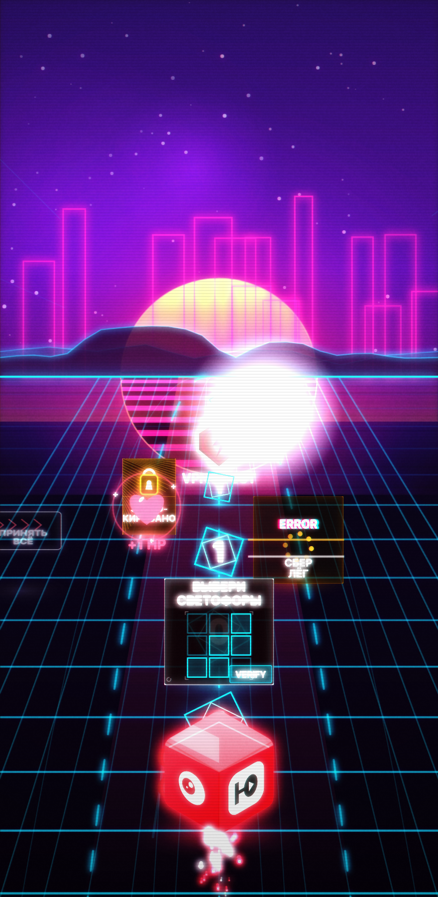
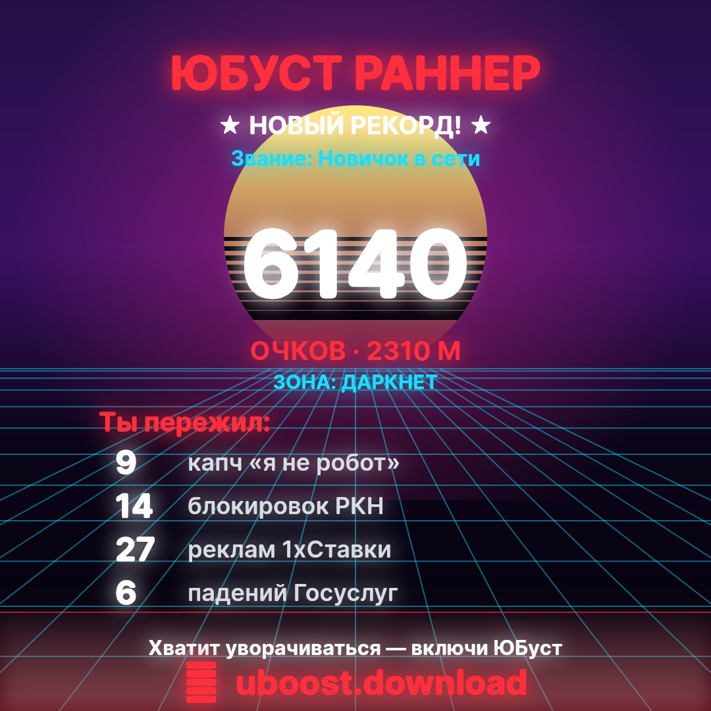

# 🚀 ЮБуст Раннер

Виральная мини-игра для продвижения VPN **ЮБуст** (Telegram Ads + веб).
Чёрно-красный раннер по 3 полосам: ракета-маскот летит по рунету на бешеной
скорости, идёт по светящемуся **потоку данных**, уворачивается от РКН, капч,
казино и падений Госуслуг, ловит **ВПН-буст** и набивает рекорд. На финише —
стильная шеринг-карточка и CTA на настоящий ЮБуст.

Поле спавна — честный **коридор**: безопасная полоса всегда достижима (смещение ≤ 1),
а дистанция между колоннами ≥ `speed × REACT_TIME` — на любой скорости успеваешь
сменить полосу. Смерть всегда «по делу», а не из-за нечестной стены.

<p align="center">
  
  &nbsp;&nbsp;
  
</p>

> Превью отрендерены движком игры (`npm run shots`).

## 🎮 Как играть
- **Свайп ←/→** (моб.) / **тап по левой или правой половине экрана** / **стрелки ←/→ или A/D** (десктоп) — смена полосы.
- Иди по **потоку данных** (светящаяся дорожка) — он ведёт в безопасную полосу и даёт очки.
- Лови щит **ВПН** → гипер-скорость + неуязвимость, круши мусор.
- Помри красиво → получи карточку с мемной статистикой и поделись.

## 🧱 Стек
Чистый **vanilla JS + Canvas**, нативные ES-модули, **без билд-степа и зависимостей** —
идеально для GitHub Pages и Telegram WebApp. Звук — процедурный (WebAudio), без файлов-ассетов.
Маскот и все препятствия рисуются кодом.

```
config.js          # ВСЕ тюнинги и ссылки — меняй тут
index.html
styles/style.css
src/
  main.js          # цикл, состояния, оркестрация
  engine/          # render · particles · input · audio
  game/            # world · player · obstacles · collectibles · boosts · stats · sharecard
  ui/              # screens · strings (весь копирайт/мемы)
```

## ▶️ Запуск локально
ES-модули требуют http (не `file://`):
```bash
cd uboost-runner
python3 -m http.server 8000
# открыть http://localhost:8000
```

## ✅ Проверка (без браузера)
```bash
npm test     # headless smoke-тест: грузит модули, крутит 600 кадров, ловит рантайм-баги
npm run shots  # рендерит preview/*.png реальным движком игры (нужен dev-dep @napi-rs/canvas)
npm run verify # полный локальный прогон: test + shots
```

## 🌐 Деплой на GitHub Pages
Workflow `.github/workflows/pages.yml` уже настроен и перед деплоем гоняет `npm test`.
Отдельный workflow `.github/workflows/ci.yml` проверяет PR/ветки и сохраняет preview-артефакты.
Один раз включи Pages: **Settings → Pages → Source: GitHub Actions**. После пуша
игра будет на `https://<owner>.github.io/uboost-runner/`.

> После деплоя пропиши реальный адрес игры в `config.js → GAME_URL` (для шеринга).

## 🔧 Что подменить под бренд (всё в `config.js`)
| Ключ | Назначение |
|------|------------|
| `STORE_URL` | ссылка CTA «настоящий ЮБуст» (сейчас `https://uboo.st/`) |
| `GAME_URL`  | ссылка на игру для шеринга |
| `TG_BOT_URL`| опц. ссылка на бота |
| `COLORS`    | чёрно-красная палитра бренда |
| `REACT_TIME` / `COL_SPACING_MIN` | честность коридора (запас на реакцию) |
| `BLOCK2_BASE` / `BLOCK2_MAX` / `DIFF_DIST` | кривая сложности |
| скорости/буст/очки/`SPEEDLINES` | баланс и ощущение скорости |

Мемный копирайт и подписи препятствий — в `src/ui/strings.js`.
Реальный бренд-маскот/лого можно подменить позже (сейчас ракета рисуется в `src/game/player.js`).

Для платного трафика открывай игру с `?safe=1`: включится пародийный копирайт
без чужих брендов, и этот режим сохранится в challenge-ссылках.
